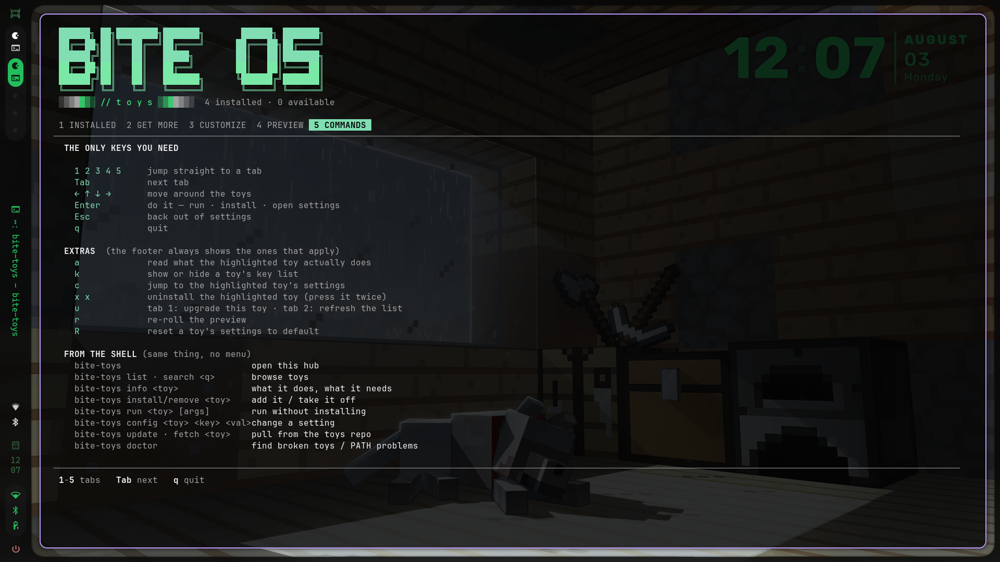
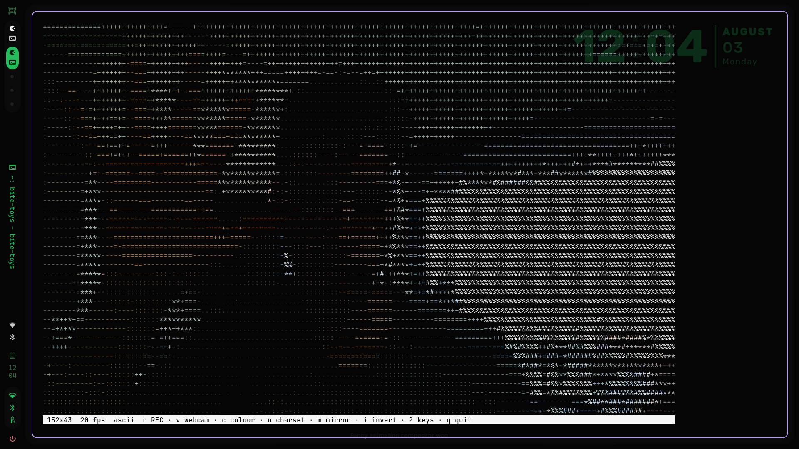
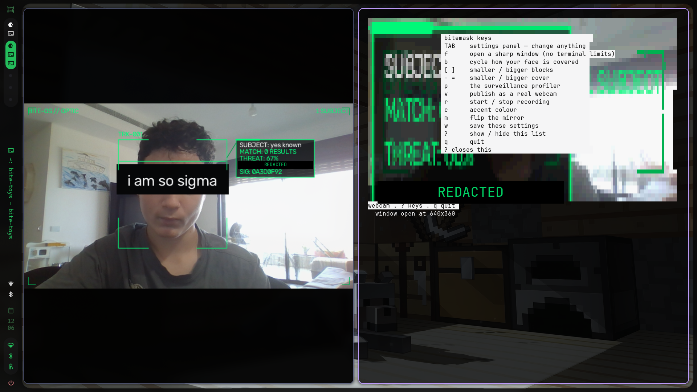
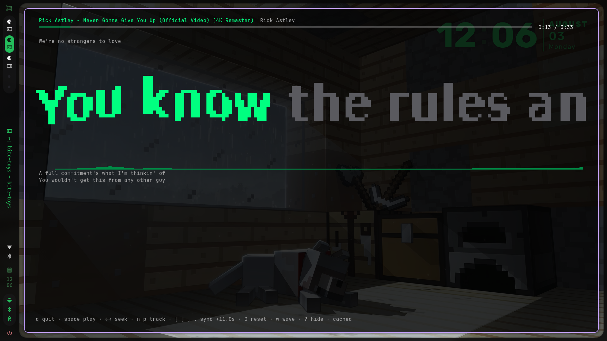
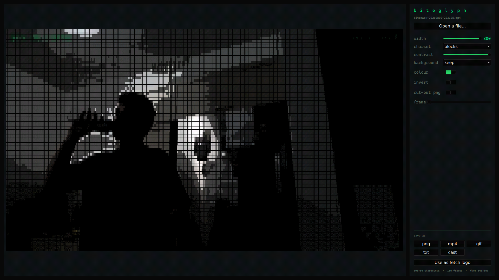
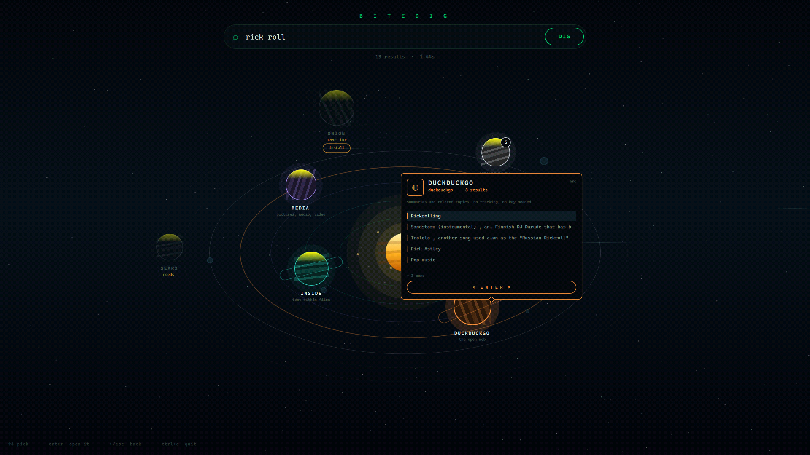
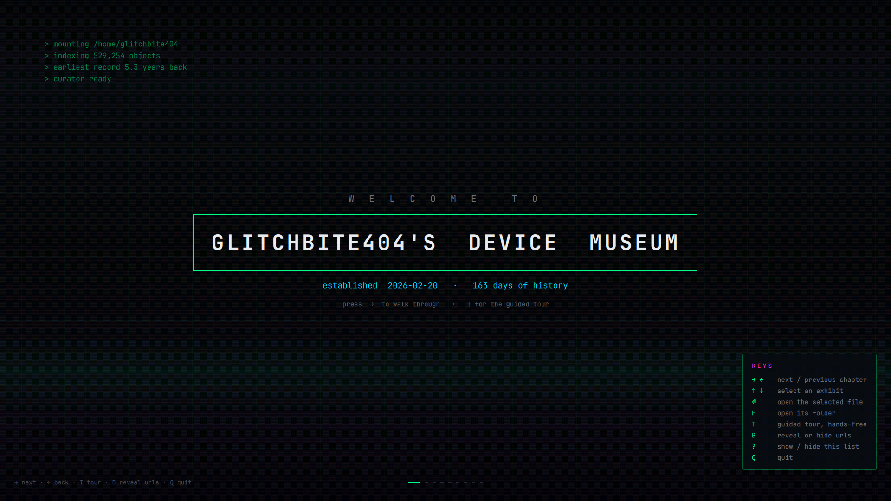
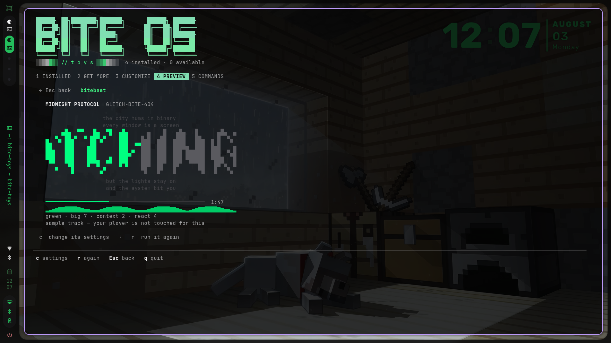
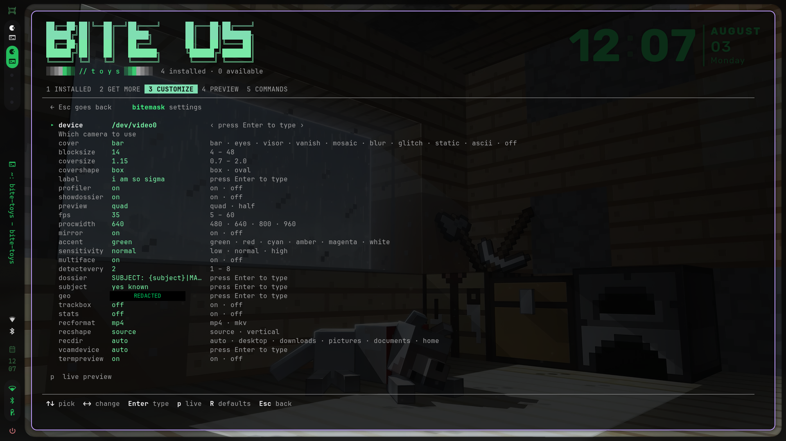

# bite-os-toys

**The toy catalog for [BITE-OS](https://github.com/GLITCH-BITE-404/BITE-OS).**

`bite-toys` is a hub for the fun half of the system — browse it, install what you
want, tweak it, throw it away. This repo is where the downloadable toys live.

Toys bundled on the ISO work offline from `/usr/share/bite-os/toys`. Everything
else comes from here: `bite-toys update` reads `catalog.tsv`, and
`bite-toys fetch <toy>` pulls the matching tarball and checks it against its
published hash before unpacking a single byte.

```
catalog.tsv                    name <TAB> version <TAB> sha256 <TAB> description
toys/<name>-<version>.tar.gz
```



> **[How it works](HOW-IT-WORKS.md)** — the toy contract, the catalog, the
> trust model, and how to write your own.
> **[Compatibility](COMPATIBILITY.md)** — which distros, terminals and fonts
> this actually runs on.

---

## Install a toy

```sh
bite-toys update              # refresh the catalog from this repo
bite-toys fetch bitemask      # download it
bite-toys install bitemask    # put it on your PATH as a real command
bitemask                      # run it
```

## Updating the hub itself

The catalog can hand you new toys, but it can't hand you a new hub — so the hub
publishes its own version and checksum in `hub.tsv`, right next to `catalog.tsv`,
and can pull a newer copy of itself over the old one:

```sh
bite-toys --version           # what you're on
bite-toys self-update         # pull a newer hub
```

`bite-toys update` and `bite-toys doctor` both tell you when one is waiting, and
the hub header shows `↑ hub 1.2` while it is.

It refuses rather than guesses. A **checksum mismatch** or a download that
**doesn't parse as bash** is thrown away with the running hub untouched — a
broken hub is the one thing that can't repair itself. The new copy is staged
next to the old one so the final step is an atomic rename, and your previous
version is kept in `~/.cache/bite-os/`. Installing a toy symlinks
`~/.local/bin/<toy>` at the hub itself, so replacing the file keeps every shim
working.

**If pacman owns it, pacman updates it.** A hub at `/usr/bin/bite-toys` came
from the `bite-os` package, and writing over it would work exactly once — until
the next `-Syu` put it back. It says so and points you at `sudo pacman -Syu
bite-os` instead.

Or just run `bite-toys` with no arguments and use the hub.

```
 ██████╗ ██╗████████╗███████╗       ██████╗ ███████╗
 ██████╔╝██║   ██║   █████╗        ██║   ██║███████╗
 ╚═════╝ ╚═╝   ╚═╝   ╚══════╝       ╚═════╝ ╚══════╝
 ░▒▓█▓▒░ // t o y s ░▒▓█▓▒░

  1 INSTALLED   2 GET MORE   3 CUSTOMIZE   4 PREVIEW   5 COMMANDS
```

| key | what it does |
|---|---|
| `1`–`5`, `Tab` | switch tabs |
| `← ↑ ↓ →` | move through the toys |
| `Enter` | run it · install it · open its settings |
| `a` | read what the highlighted toy actually does |
| `k` | show the toy's key list |
| `c` | jump to its settings |
| `x` `x` | uninstall (press twice — it asks first) |
| `u` | upgrade this toy |
| `q` | quit |

---

## The toys

Anything tagged **`⚙ tool`** does a job rather than being a gimmick — same
contract, same hub, it just isn't pretending to be a toy.

### `bitecam` — your webcam, live, as ASCII

Real-time ASCII from your camera at whatever size the window is. ffmpeg captures
and scales, numpy does the pixel→character mapping, so it stays smooth
full-screen.

- `r` records straight to **mp4**, **gif**, or an asciinema **cast**
- `v` publishes it as a **real webcam** — Zoom, Discord and Meet can select it
  (run `bitecam --setup-camera` once first)
- `n` cycles character ramps, `c` flips truecolour/mono, `i` inverts, `m` unmirrors



Settings include `charset`, `color`, `fps`, `mirror`, `invert`, `recformat`,
`recdir`, `reccell`. **Needs:** ffmpeg, python-numpy, python-pillow.

### `bitemask` — covers your face, and profiles it like you're being tracked

Finds your face in the webcam feed and refuses to show it. `b` cycles how it's
covered:

| mode | what it does |
|---|---|
| `bar` | the black REDACTED strip |
| `eyes` | anonymity strip across your eyes only |
| `visor` | a glowing band |
| `vanish` | learns the room behind you and paints it back over your head |
| `mosaic` / `blur` | pixelation / softening |
| `glitch` | tears the colour channels apart |
| `static` | punches a hole of noise |
| `ascii` | redraws the face as characters |

`vanish` is the strange one — you don't get censored so much as edited out. Give
it a second or two of empty frame to learn the background first.

Press `p` for the **profiler**: brackets, a sweeping scan line, and a dossier
that types itself out beside your head. `TAB` opens a settings panel you can
change anything from without leaving the toy; `w` saves it.



It works on **real pixels, not ASCII**, so `v` puts your censored face into a
call as an ordinary webcam, and `r` records to mp4 — set `recshape=vertical` and
it comes out 1080×1920, ready to post. The terminal preview is coarse by nature
(one glyph per character cell); press `f` for a real window at full resolution.

The dossier is a template you write yourself — `{subject}`, `{threat}`, `{geo}`,
`{hash}` and friends get filled in. It is set dressing: bitemask never looks
anything up and makes no network request of any kind.

**Needs:** ffmpeg, python-opencv, opencv, python-numpy.

### `bitebeat` — whatever you're playing, with synced lyrics

Reads whatever is playing over MPRIS — mpv, Spotify, VLC, a browser tab — and
shows the track with its lyrics sweeping in time, big, karaoke style.

Looks for an `.lrc` next to the audio file first, then your lyrics folder, then
lrclib.net if online lookup is on. Big text is rasterised at runtime, so it
renders Hebrew and any other script just as happily as English.



`space` play/pause, `←/→` seek, `[` `]` nudge sync, `n`/`p` track, `w` toggles
the audio reaction. The key list sits along the bottom; `?` hides it.
**Needs:** playerctl, cava, python-numpy, python-pillow.

> mpv publishes no MPRIS without the `mpv-mpris` package.

### `biteglyph` `·tool` — any picture, gif or video as ASCII art

The only one with a window. Drop in a png, jpg, gif, mp4 — anything ffmpeg
reads — and tune it live: width, character ramp, contrast, colour, invert.



Save it as whatever you need:

| format | what you get |
|---|---|
| `png` | a still — this is the one that can be a fetch logo |
| `mp4` | the animation, as real video |
| `gif` | a looping ASCII gif |
| `txt` | raw ANSI you can `cat` |
| `cast` | asciinema replay, selectable text |

**Background removal has three tiers:** it trusts the file's own transparency
when there is one, flood-fills a flat backdrop inward from the corners (ideal
for logos and icons), or falls back to OpenCV's foreground extraction for
photos — a good guess, not a perfect matte.

**"Use as fetch logo"** drops a cut-out png into `~/.config/glitch/icons`,
which is the pool `glitch-fetch` rolls from, so your terminal starts greeting
you with it. Note a dark source makes dark ASCII — turn contrast up or invert
on for something that reads on a dark terminal.

Every control is also a flag, so it scripts:

```sh
biteglyph laffy.png --out laffy.png --width 140 --charset blocks --cut auto
biteglyph clip.mp4  --out clip.gif  --width 100 --fps 12
```

**Needs:** ffmpeg, qt6-declarative, python-numpy, python-pillow.

### `bitedig` `⚙ tool` — search that goes deeper the further out you go

Fullscreen. Query at the top, space underneath. Each engine is a planet — they
drift past while idle, **swirl into orbit when you search**, and spin the whole
time. Click one to see what it found and which engine it is; unavailable engines
sit greyed out with an `install` button under them.

**`◈ ENTER THIS PLANET ◈`** runs a matrix sequence — falling glyphs, handshake,
decrypt, then the screen blooms green and the page opens for real.



Five depths, five different engines.

| depth | engine | what it reaches |
|---|---|---|
| **names** | `fd` (or `find`) | file and folder names |
| **contents** | `ripgrep` | inside text files |
| **media** | `ffprobe` | pictures, audio, video — including their tags |
| **web** | your SearxNG, else open APIs | the open web |
| **onion** | `tor` | Tor-reachable services |

**A depth whose engine is missing shows a red planet and a `get` button.**
Nothing is installed behind your back — it asks, then runs `pacman` for you.

Two things it's honest about rather than pretending otherwise:

- **Public SearxNG instances block API access.** Measured: searx.be serves a
  captcha, searxng.site 403s, priv.au 429s. Point `web_instance` at your own
  and you get real aggregated results; leave it blank and it falls back to
  DuckDuckGo's and Wikipedia's open APIs, which give summaries and articles
  rather than a ranked page of links.
- **`onion` is a curated list, not a crawler.** SecureDrop, Ahmia, archives —
  the services people have an actual reason to reach. A general onion index
  mostly surfaces markets and stolen data, which isn't worth building. Nothing
  goes over Tor without a confirmation, and Tor must be installed first.

```sh
bitedig "wolf" --depth names,contents --root ~/projects
bitedig "cachyos" --depth web
bitedig --engines            # which depths are ready, what's missing
```

**Needs:** qt6-declarative, python. Everything else is per-depth and optional.

### `bitemuseum` — your machine's history as an exhibition

Turns your own disk into a museum. Opens on a title card, then walks through
chapters: the day the machine was installed, the oldest files you still own,
your earliest photos shown for real, the first sites you ever visited, the
heaviest things you're carrying, and what you've forgotten.

`T` starts a guided tour that advances on its own every 7 seconds so you can
film it hands-free. `Enter` opens the real file, `F` opens its folder.



Strictly read-only. Browser history stays hidden until you press `B`.
**Needs:** qt6-declarative, python.

### `biteprank` — a prank link you send, that goes off on their screen

Not a prank you run on your own machine. `biteprank` forges one self-contained
web page and hands you a link to send someone. Everything happens inside their
browser tab, which means it cannot touch a file, install anything, or survive
the tab closing.

**The link does not open on a wall of red text.** It opens as something
ordinary — and the scene erupts out of whatever they press.

| bait | what they see first |
|---|---|
| `video` | a message with a blurred clip, a play button and *"is this you?? look at 0:14"* |
| `photo` | a photo blurred out with **tap to reveal** over it |
| `folder` | a shared folder, three believable files, an **Open** button |
| `none` | no disguise — straight into the scene |

That disguise isn't decoration. A browser refuses fullscreen and refuses to make
any sound until the visitor has *deliberately* clicked something, so the bait is
what earns the one click that makes everything else work.

```sh
biteprank                                    # pick a scene, a bait and a delivery
biteprank trace                              # forge it with your defaults
biteprank make -s ransom -n Yuval -b video -H tunnel
biteprank list --full                        # what all fifteen actually do
```

#### Why it lands

`trace`, the flagship, prints a column of facts about whoever opened it — and
they are all **true**: their public address, the city it resolves to, their
carrier, their browser and OS, their screen, their timezone, their exact battery
percentage ticking down as they watch. Once those land, the fake half underneath
— a directory listing and a 4.2 GB upload bar — is believed too. No exploit,
just theatre with a few honest sentences in it.

The scenes that imitate an operating system are built to **match** it, not to
look cool. There is no CRT filter over them — that is opt-in, because a
scanlined BSOD is a poster of a BSOD.

| scene | what it actually is |
|---|---|
| `bsod` | Segoe UI on the real `#0078D7`, thin sad face, percentage that sticks and jumps, and the QR block beside the support text — with the failing module named after their *actual* browser |
| `format` | an elevated Command Prompt: real title bar, real build banner, the `system32` prompt, and `format.com`'s own capitalised warning |
| `update` | the five-dot Windows spinner, built properly, stuck at 99% for seven seconds before it gives up and starts undoing changes |
| `panic` | a bare console — grey on black, no filter, and the cursor stops blinking at the end, because a panicked kernel stops updating the screen |

The rest are the stylised ones: forty-five wandering cursors, a screen that
shatters from a random impact point, a battery that drains from wherever theirs
really sits, and a calm paragraph that decays into `MEMORY FAULT`. `format`, `ransom` and `webcam` are marked **spicy** — they read as
genuinely real to people who have actually been hacked. Aim carefully.

`bitten` is the opposite: no scare at all. It shows the same real fields and
closes by pointing out that every site they visit can already read all of it.
A prank that ends as a privacy demo.

#### Sending it

| delivery | what you get | needs |
|---|---|---|
| `tunnel` | a public link that works anywhere, and dies when you `Ctrl-C` | cloudflared |
| `local` | a link only reachable on your own Wi-Fi | — |
| `github` | a permanent link on GitHub Pages | git + `ghrepo` set |
| `file` | a `.html` on disk — for testing on yourself, **not** for sending |  — |

Nothing is a dependency of the toy, only of one particular way of sending, so
`biteprank list` never demands a package. Pick a delivery you don't have the
tool for and **it offers to install it** — say no and it prints the deliveries
that work right now instead.

The link is copied to your clipboard, and printed as a QR code for handing a
prank to someone's phone across a table.

#### Watching it land

With `tunnel` or `local` your terminal becomes a live feed:

```
  ● 14:04:59  opened the link                   · 81.218.44.207 · Chrome on Android
  ● 14:05:00  took the bait — scene is running  · 81.218.44.207 · Chrome on Android
  ● 14:05:01  reached the GOTCHA                · 81.218.44.207 · Chrome on Android
```

#### What it will not do

- **No bait or scene ever asks for a password, a login, or a payment.** That
  stops being a prank and starts being phishing.
- **None of them imitate a real company** — no logos, no brand names, no
  lookalike domains.
- **Nothing about the visitor is stored anywhere.** The geo lookup happens in
  their tab and the answer never leaves it. The one thing that travels is a
  single word per stage, back to the little server in your own terminal, holding
  no data beyond the request that server already saw. It is never written down
  and dies with the link.
- **`ESC` ends any scene instantly**, and every single one resolves to the same
  reveal: a big **GOTCHA** and a plain sentence saying nothing happened and
  nothing was taken — including telling them about that ping.

A prank someone can't escape, or can't tell was a prank afterwards, is just
being mean to somebody.

**Needs:** nothing to run. `cloudflared` for a public link, `qrencode` for the
QR, `git` for GitHub Pages.

---

## Trying settings before you keep them

The **PREVIEW** tab renders each toy from a built-in sample scene, so nothing
runs until you press Enter and no camera or music player is ever opened for it.

`bitecam` and `bitemask` are **drawn** rather than run. Both already preview
themselves without touching the camera — but they do it with real pixel video,
and real video squeezed into a pane this size turns a 10px dossier into
unreadable coloured mush. So the hub renders the same HUD in characters, at a
size you can actually read, tagged `·mockup` and captioned so it is never
mistaken for a live frame. `bitedig`, `biteglyph` and `bitemuseum` draw
themselves in real windows, so they say why they have no preview instead of
painting an empty pane.



Press `c` and the picture holds still while you change settings; `Enter` runs it
again with the new values so you can see the difference, and `w` keeps them.
Anything you have not kept is marked `●` and is discarded when you back out —
your config file is not touched until you say so.

## Settings

Every toy's settings live in `~/.config/bite-os/toys/<toy>.conf` and are handed
to it as `TOY_<KEY>` environment variables — a toy never parses configuration
itself.



```sh
bite-toys config bitemask                 # list them
bite-toys config bitemask cover           # read one
bite-toys config bitemask cover vanish    # change one
bite-toys reset bitemask                  # back to defaults
```

Values are checked against the toy's declared `@choices` and `@range`, so a typo
is rejected instead of being silently ignored at runtime.

---

## Security

`catalog.tsv` is the trust anchor. **A toy is arbitrary code**, so `fetch` checks
every tarball against its published sha256 and refuses to unpack one that does
not match. A toy with no published checksum installs with a visible warning.

`bite-toys remove` never deletes your only copy of a toy — it takes it off your
PATH and tells you where the files are. Deleting them is a separate, explicit
`bite-toys purge`, which asks first.

---

## Publishing a toy

Don't build tarballs or checksums by hand — the point of the packer is that the
catalog and the tarballs can't drift apart:

```sh
bite-toys new mytoy          # scaffold one that already works
$EDITOR ~/.local/share/bite-os/toys/mytoy/run
bite-toys install mytoy      # try it
bite-toys pack --out .       # rebuild every tarball + catalog.tsv
```

`pack` is reproducible — the same toy always produces the same bytes and the
same checksum, so rebuilding doesn't churn the catalog.

### A toy is just a directory

| file | what it is |
|---|---|
| `toy.meta` | `name`, `version`, `desc`, `category`, `exec`, `deps`, plus `usage`, `keys`, `about`, `preview`, `input` |
| `run` | the executable (or whatever `exec=` names) |
| `config.def` | defaults; `#` lines above a key are its help text |

In `config.def`, `# @choices a,b,c` and `# @range 0-10` above a key let the hub
cycle values with the arrows.

`deps=` entries are `cmd`, `cmd:package`, or `py:module:package` — commands are
what the toy needs at runtime, packages are what pacman has to install, and they
are often not the same word. Missing dependencies are offered as a `pacman -S`
on first run rather than crashing.

---

## Docs

- **[HOW-IT-WORKS.md](HOW-IT-WORKS.md)** — architecture, the toy contract,
  checksums, the preview system, and why it is written in bash
- **[COMPATIBILITY.md](COMPATIBILITY.md)** — distros, terminals, fonts, and the
  exact packages each toy needs

## License

GPL-3.0 — see [LICENSE](LICENSE).

BITE-OS, its name and branding are the original work of **GLITCH-BITE-404**
(Raphael Virnik). Forks must keep the credit and stay GPL-3.0.

`// THE SYSTEM BIT YOU`
